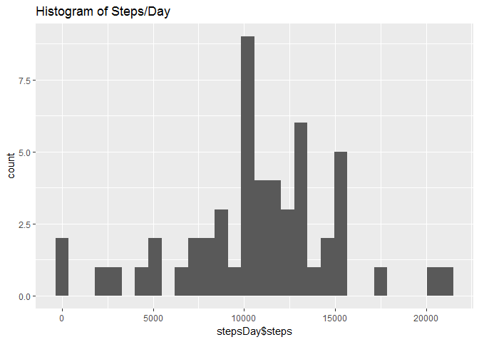
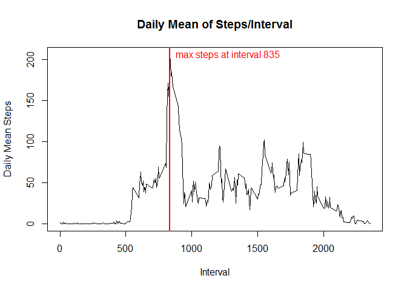
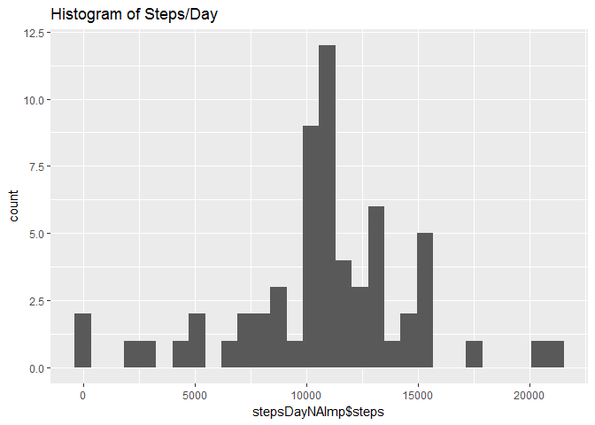
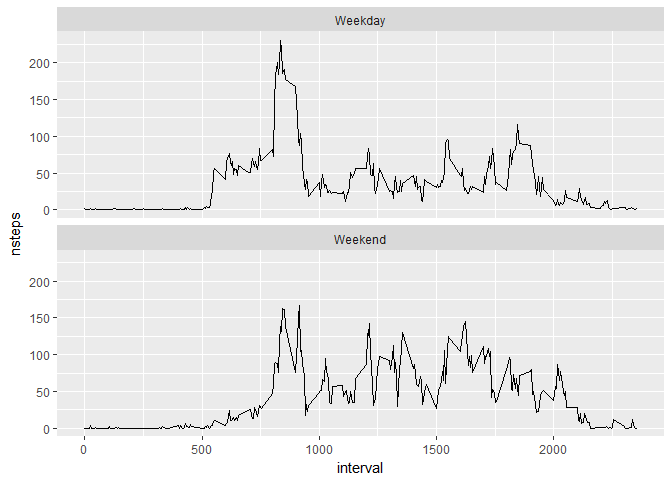

## Loading and preprocessing the data
The dataset is downloaded and read in here:

```r
library(lubridate, warn.conflicts = FALSE)
source("downloadFile.R") # dowwnloads files to ./data
# Download data from source
fileList <- c("https://d396qusza40orc.cloudfront.net/repdata%2Fdata%2Factivity.zip")
outFileList <- paste0("./data/",basename(fileList))
# Download zip file
downloadFile(fileList)

# Unzip file if not already done 
if(!file.exists("./data/activity.csv")) {
    unzip(outFileList,exdir = "./data")
}

# Readin data
if(!exists("NEI")) {
    activity <- read.csv("./data/activity.csv")
}

# change date to date format
activity$date <- ymd(activity$date)
```


## What is mean total number of steps taken per day?

```r
    library(ggplot2, warn.conflicts = FALSE)
    stepsDay <- aggregate(steps ~ date, activity, sum)
    qplot(stepsDay$steps, main = "Histogram of Steps/Day")
```

```
## `stat_bin()` using `bins = 30`. Pick better value with `binwidth`.
```

<!-- -->

#### The mean and median steps per day are 10765.00 and 10766.19 steps, respectively.

## What is the average daily activity pattern?

```r
    stepsInt <- aggregate(steps ~ interval, activity, mean)
    plot(stepsInt$interval,stepsInt$steps,type = "l",main = "Daily Mean of Steps/Interval",xlab = "Interval",ylab="Daily Mean Steps")
    abline(v=with(stepsInt,subset(interval,steps==max(steps))),col="red",lwd="2")
    text(with(stepsInt,subset(interval,steps==max(steps))),max(stepsInt$steps),paste("max steps at interval" ,with(stepsInt,subset(interval,steps==max(steps)))),pos = 4,col="red")
```

<!-- -->


## Imputing missing values

```r
library(dplyr,ggplot2, warn.conflicts = FALSE)
    print(paste("Total NA values = ", sum(is.na(activity$steps))))
```

```
## [1] "Total NA values =  2304"
```

```r
    # Replace mising values with daily mean per interval
    df <- left_join(activity,stepsInt,by="interval")
    df<-mutate(df,final=coalesce(df$steps.x,as.integer(round(df$steps.y))))
    activityNAImp <- data.frame(steps = df$final,date=activity$date,interval=activity$interval)
    
    # Recalculate steps per day and make histrogrm
    stepsDayNAImp <- aggregate(steps ~ date, activityNAImp, sum)
    qplot(stepsDayNAImp$steps, main = "Histogram of Steps/Day")
```

```
## `stat_bin()` using `bins = 30`. Pick better value with `binwidth`.
```

<!-- -->

#### The mean and median steps per day with imputed values for NA's, using the daily average per interval, are 10762.00 and 10765.64 steps, respectively. These values compare well with the original values of 10765.00 and 10766.19 steps, respectively.

## Are there differences in activity patterns between weekdays and weekends?

```r
    library(dplyr,ggplot2, warn.conflicts = FALSE)
    activityNAImp %>%
    mutate(week=factor(weekdays(activity$date) %in% c("Saturday","Sunday"), labels = c("Weekday","Weekend") )) %>%
    group_by(interval,week) %>%
    summarise(nsteps = mean(steps)) ->
    activityNAImpWd
    
    g<- ggplot(data=activityNAImpWd,aes(interval,nsteps))+geom_line()+facet_wrap(~ week, nrow = 2)
    print(g)
```

<!-- -->
